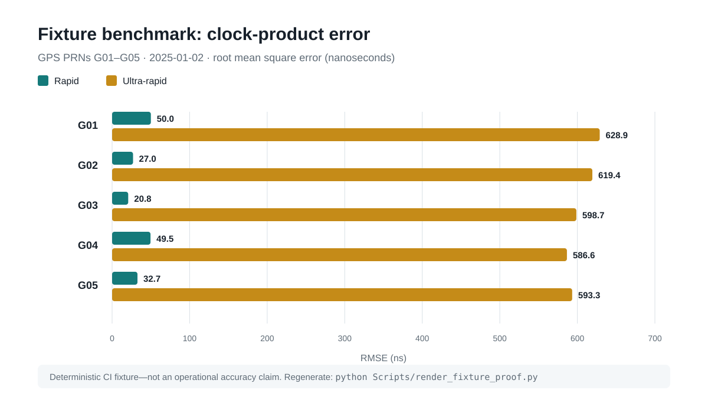

# GNSS Clock Pipeline

[](https://github.com/Xyloth/gnss-clock-pipeline/actions/workflows/ci.yml)
[](pyproject.toml)
[](LICENSE)

Production-style Python ETL that turns raw multi-constellation satellite-clock and space-weather feeds into a schema-validated, Hive-partitioned Parquet feature store. The repository preserves 30-second observations, detects residual anomalies, records rerunnable job state, and benchmarks rapid/ultra-rapid products against final clocks.

**[Run the 90-second proof](#90-second-proof)** · **[Inspect the data contracts](docs/schema.md)** · **[Read the negative-result postmortem](docs/results.md)** · **[See CI](https://github.com/Xyloth/gnss-clock-pipeline/actions/workflows/ci.yml)**

## 90-second proof

The committed fixtures are small, deterministic, and offline. They exercise the same parser, benchmark, and validation code as larger runs.

```bash
git clone https://github.com/Xyloth/gnss-clock-pipeline.git
cd gnss-clock-pipeline
python -m venv .venv
source .venv/bin/activate          # Windows: .venv\Scripts\activate
pip install -e ".[dev]"
pytest -q
python Scripts/render_fixture_proof.py --check
```

That verifies RINEX parsing, rapid/ultra clock adapters, episode construction, canonical Arrow schema normalization, Hive/per-year parity, L6 context joins, and product-to-final benchmark metrics. CI repeats the suite on Python 3.10, 3.11, and 3.12.



The figure is regenerated directly from the committed RINEX and Parquet fixtures by [`Scripts/render_fixture_proof.py`](Scripts/render_fixture_proof.py). It is a deterministic pipeline proof, **not an operational accuracy claim**.

### What a reviewer can verify quickly

| Engineering claim | Evidence in this repository |
| --- | --- |
| Raw scientific files become typed, queryable data | RINEX `AS` records are parsed into tidy clock Parquet with source, cadence, issue-time, and lead-time metadata. |
| Corrupt refreshes fail closed | A dedicated CLI asserts exact Arrow schema, cadence, severity rules, and Hive/per-year row parity, then exits non-zero on failure. |
| Jobs are rerunnable and inspectable | Output validation controls resume/force behavior; bounded JSONL state records inputs, outputs, metrics, and arguments. |
| The evaluation was not reverse-engineered into a success story | The published model result did not beat the operational baseline; the postmortem names leakage, grain, imbalance, and lead-time limitations. |

## Architecture

```
                    ┌────────────────────────────────────────────────┐
                    │  Public sources (IGS, MGEX, NOAA, GFZ, OMNI2)  │
                    └────────────────────────────────────────────────┘
                                        │
                                        ▼
   L1  Raw ingest        ─────────  RINEX CLK  +  SP3 orbits  +  space-weather indices
                                        │
                                        ▼
   L2  Enrichment        ─────────  Satellite geometry (β-angle, eclipse, sub-sat lat/lon)
                                    Space-weather joins (Kp, Dst, F10.7, BZ, Vsw, SymH)
                                        │
                                        ▼
   L3  Feature build     ─────────  Per-PRN per-day aggregates
                                    Residual MAD-based spike detection
                                        │
                                        ▼
   L5  Episodes          ─────────  Severity bins (S0/S1/S2/S3) + duration windowing
                                    Hive-partitioned by system / year
                                        │
                                        ▼
   L6  Enriched output   ─────────  Episode tables joined back with daily L3 context
                                    Canonical Arrow schema, validated on write
```

## What's in this repo

| Component | Files | Purpose |
| --- | --- | --- |
| `corr/` package | 11 modules | Library code: RINEX CLK parsing, episode detection, schema validation, context joins |
| `Scripts/` | 7 pipeline CLIs + proof renderer | Independently runnable stages plus a fixture-backed visualization with a stale-artifact check |
| `tests/` | 7 test modules + fixtures | Pytest suite with curated <50 KB sample data—pipeline paths run offline on `pytest` alone |
| `docs/` | 4 technical notes + generated figure | Architecture, data quality, schema, results, and a reproducible first-click visual |

The repo is built around a layered ETL convention (L1 → L2 → L3 → L5 → L6). Each stage has a defined input contract, a Parquet output, and validation logic — see [docs/architecture.md](docs/architecture.md) for details.

## Why this matters

GNSS satellite clocks broadcast the timing signals every GPS-equipped device on Earth depends on. When a clock drifts or jumps, the error propagates directly into positioning accuracy. The IGS publishes "final" clock corrections at ~2-week latency; the goal of this project was to detect anomalies earlier from rapid (1-day) and ultra-rapid (15-minute) products, using both the clock signal itself and space-weather features that are known to correlate with hardware behavior.

## Pipeline stages

Each Script is independently runnable and writes Parquet to a configurable output directory. Examples below use the bundled test fixtures.

### Clock adapters — L1 raw → tidy
```bash
python Scripts/clk_adapters.py --source rapid \
    --inputs tests/data/clk/rapid_fixture_20250102.clk \
    --output-dir Reports/DEV_Rapid --force
```
Converts RINEX clock files (rapid or ultra-rapid) into tidy Parquet with the schema `(system, prn, ts_utc, bias_ns, epoch_seconds, source)` and lead-time metadata for ultra-rapid products.

### Episodes — L3 / L5 builder
```bash
python Scripts/build_episodes_v31.py --mode fixtures \
    --reports-root /tmp/reports \
    --fixtures-context tests/data/l3_fixture.parquet \
    --state-path /tmp/state/memory.jsonl
```
Detects clock anomalies using a 31-epoch running-median baseline + MAD-scaled severity bins, writes per-system-per-year episode Parquet, and appends a JSONL run state.

### Normalize — L5 canonical schema + Hive partitioning
```bash
python Scripts/normalize_l5_v31.py \
    --source-root <ragged input> --hive-root <hive output> \
    --years-root <flat output> --manifest-path <manifest.json>
```
Recasts heterogeneous L5 outputs into the canonical [Arrow schema](docs/schema.md) and writes Hive-partitioned (`system=…/year=…/`) Parquet plus per-year materializations and a JSON manifest for downstream auditing.

### Validate — schema + parity checks
```bash
python Scripts/validate_l5_v31.py --hive-root <hive> --years-root <years>
```
Asserts canonical schema equality, epoch cadence, severity OR-rules, and parity between Hive and per-year materializations. Exits non-zero on any check failure — drop-in for CI gates.

### L6 enrichment — episode × daily context
```bash
python Scripts/l6_enrich.py \
    --episodes tests/data/episodes_fixture.parquet \
    --l3 tests/data/l3_daily_fixture.parquet \
    --output-dir Reports/DEV_L6_Enriched
```
Left-joins L5 episodes with L3 daily aggregates (β-angle, sub-sat lat, Kp, F10.7, eclipse window) into a feature-rich table for downstream analytics.

### Bench — rapid/ultra vs final
```bash
python Scripts/bench_2025.py \
    --final tests/data/final_fixture.parquet \
    --rapid <rapid.parquet> --ultra <ultra.parquet> \
    --output-dir Reports/DEV_Bench
```
Computes MAE / RMSE / MedAE per system / PRN / day across rapid vs final, plus ultra-rapid lead-time bins. Outputs Parquet + console summary.

## Data quality methodology

Each pipeline stage has explicit data-quality contracts. See [docs/data-quality.md](docs/data-quality.md) for the full writeup. Highlights:

- **Sigma-via-MAD**: residuals are scaled with `1.4826 × MAD` so a single outlier doesn't inflate the noise floor.
- **Severity bins** (`S0/S1/S2/S3`) drawn from absolute-residual quantiles — explicit thresholds at 0.5, 3.0, 5.0 ns make the classification reproducible and reviewable.
- **Duration-based promotion**: an `S2` episode lasting ≥ 120 seconds is promoted to `S3`, capturing operationally significant drift events that pure-magnitude bins would miss.
- **System guard**: `read_clk_file` rejects files where the AS records don't match the declared GNSS letter — protects against accidentally feeding (e.g.) GLONASS data into the GPS pipeline.
- **Schema validation**: `validate_l5_v31.py` asserts canonical Arrow schema equality on every Hive partition before downstream code reads it.

## Results

This pipeline was built as the data-engineering substrate for a downstream ML experiment: predicting satellite-clock spikes from rapid + ultra-rapid products and space-weather features, with the goal of beating the operational ~2-week IGS final-product latency.

**The model didn't beat the operational baseline.** [docs/results.md](docs/results.md) walks through the experiment honestly: what was tried (logistic regression and gradient-boosted trees over the L6 feature table), what the evaluation showed, and the most likely reasons the approach fell short — chiefly that the residual signal in rapid products is dominated by noise sources that aren't well-captured by the chosen feature set on the timescales available.

The pipeline itself, however, produces exactly what it was designed to produce: a clean, partitioned, validated feature store at 30-second resolution across 8 years and 4 GNSS constellations. That's the deliverable on display in this repo.

## What I'd do next

Concrete moves if I were extending this in a production data-engineering setting:

- **Cloud storage layout**: replace local `Reports/` with S3 partitioned by `system=/year=/month=/`; landed Parquet keyed off the IGS publish timestamp.
- **Warehouse**: stand up a Snowflake `RAW` schema for tidy L1 outputs, an `L3_FEATURES` schema for daily aggregates, and `L5_EPISODES` / `L6_ENRICHED` for analytics. Star-schema modeling on `dim_satellite` / `dim_date` / `dim_space_weather`.
- **Transformations as code**: port the L2 → L3 → L5 → L6 logic to dbt models so transformations are versioned, tested, and run from the same lineage graph.
- **Ingest orchestration**: Airflow or Dagster DAG triggering on IGS publication windows; one task per system per day with retries and SLA monitoring.
- **CI/CD**: this repo has a basic GitHub Actions workflow (lint + test on three Python versions). A production version would add deploy gates for the dbt models, slim Docker images for the ingest Lambdas, and PR-comment data-quality summaries.

## Tech stack

- **Python 3.10+**, pandas, numpy, pyarrow
- **Parquet** with Hive partitioning for the feature store
- **pytest** for the test suite (CI-runnable on bundled fixtures)
- **ruff** for lint/format
- **GitHub Actions** for CI

## Project status

This is a portfolio extract of a longer-running personal R&D project. The full archive (~187 GB of multi-year processed data) is not published. This repo contains the pipeline code, library, test suite, and documentation that demonstrate the engineering — runnable end-to-end on the bundled fixtures.
