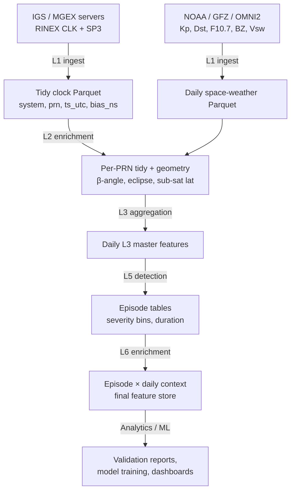

# Architecture

## Overview

The pipeline is organized as a tiered ETL with explicit input/output contracts at each layer. Each layer is independently runnable and produces Parquet artifacts that the next layer consumes.

## Layers

### L1 — Raw ingest
**Sources**: IGS / MGEX FTP, NOAA, GFZ, OMNI2.
**Outputs**: Raw RINEX clock files (`*.clk_30s`), SP3 orbit files, daily space-weather CSVs.
**Code**: `corr/clk_adapters.py`, `Scripts/clk_adapters.py`.
**Contract**: Files arrive in their native formats. The clock adapter parses RINEX `AS` records into a tidy DataFrame with columns `(system, prn, ts_utc, bias_ns, epoch_seconds, source)` plus `(issued_at, lead_time_seconds)` for ultra-rapid products.

### L2 — Enrichment
**Inputs**: Tidy L1 clock Parquet + SP3 orbits + space weather.
**Outputs**: Per-PRN-per-day enriched table with satellite geometry and space-weather context.
**Geometry features**: β-angle (sun–satellite–earth), sun–sat–earth phase angle, sub-satellite lat/lon, eclipse umbra/penumbra windows.
**Space-weather features**: Kp (planetary disturbance), Dst (storm-time), F10.7 (solar flux), BZ (interplanetary magnetic field z-component), Vsw (solar wind speed), SymH (symmetric H-component).

### L3 — Daily features
**Inputs**: L2 enriched per-PRN-per-day tables.
**Outputs**: Daily aggregate Parquet with per-day statistics (mean / p05 / p50 / p95 of geometry, max / mean of space weather).
**Purpose**: Provides the daily-grain context that L5 episodes are joined with downstream.

### L5 — Episode detection
**Inputs**: L1 tidy clock Parquet + L3 daily features (for context join).
**Outputs**: Episode table (one row per detected anomaly window) with canonical [Arrow schema](schema.md), Hive-partitioned by `system=` and `year=`.
**Method**: Residual MAD-based detection (see [data-quality.md](data-quality.md)).
**Code**: `corr/episodes.py`, `corr/pipeline.py`, `Scripts/build_episodes_v31.py`.

### L6 — Enriched episodes
**Inputs**: L5 episode tables + L3 daily features.
**Outputs**: Episode-level feature store with daily context attached as `<column>_day` columns.
**Code**: `corr/l6_enrich.py`, `Scripts/l6_enrich.py`.

## Cross-cutting concerns

### Idempotency
Every Script is rerun-safe. Existing outputs are skipped under `--resume`, replaced under `--force`, otherwise short-circuited based on Parquet schema validity (`_output_is_valid()`).

### State / observability
Each CLI appends a JSONL run record to `_codex_state.json` (or a `--state-path` override) capturing run timestamp, args, output paths, and metrics. Bounded at 200 entries to keep the state file lightweight.

### Validation as a first-class step
`Scripts/validate_l5_v31.py` is a dedicated CLI gate that asserts canonical schema equality, epoch cadence, severity OR-rules, and Hive ↔ per-year parity. It exits non-zero on failure and is intended to run as part of any deployment / refresh pipeline.

### Schema evolution
The canonical schema is declared in `corr/l5_schema.py` as a single `pa.schema(...)` constant. The `ensure_schema()` helper handles missing columns by null-padding, allowing sources at different schema versions to be normalized into a shared layout without losing data.
